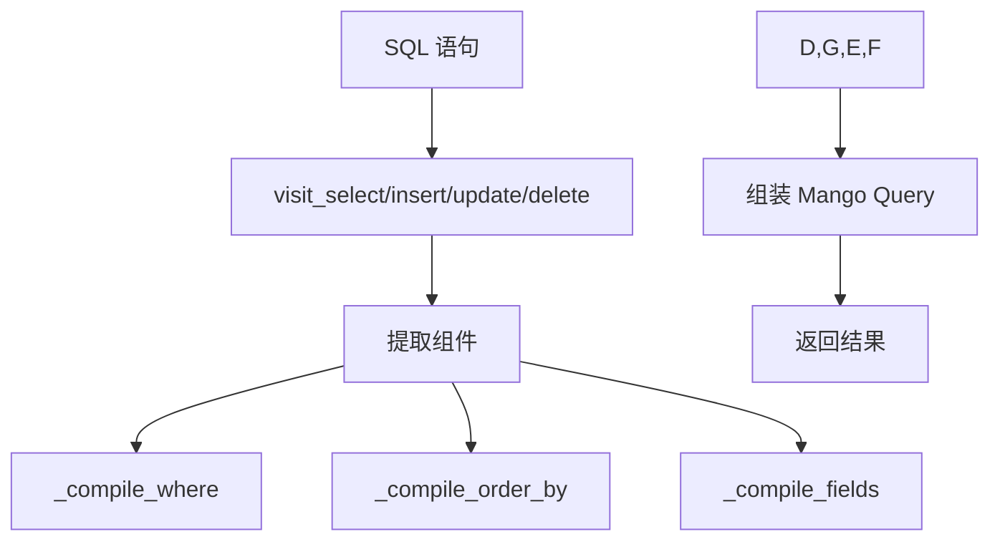

# CouchDBCompiler API

## 概述

`CouchDBCompiler` 是 SQLAlchemy 到 Mango Query 的核心编译器，负责将 SQL 语句转换为 CouchDB 可执行的 Mango Query。

## 类定义

```python
from sqlalchemy.engine.interfaces import Compiled

class CouchDBCompiler(SQLCompiler):
    """将 SQL 编译为 Mango Query"""
```

## 主要方法

### visit_select()

编译 SELECT 语句。

**签名**:
```python
def visit_select(self, select, **kwargs) -> dict:
    """编译 SELECT 语句为 Mango Query"""
```

**参数**:
- `select`: SQLAlchemy Select 对象

**返回**:
```python
{
    "selector": {...},  # Mango selector
    "fields": [...],     # 返回字段
    "sort": [...],       # 排序
    "limit": int,        # 限制数量
    "skip": int          # 跳过数量
}
```

**示例**:
```python
from sqlalchemy import text
from sqlalchemy_couchdb.compiler import CouchDBCompiler

compiler = CouchDBCompiler(dialect, None)
sql = text("SELECT * FROM users WHERE age > 25")
mango = compiler.visit_select(sql)
```

### visit_insert()

编译 INSERT 语句。

**签名**:
```python
def visit_insert(self, insert, **kwargs) -> dict:
    """编译 INSERT 语句"""
```

**返回**:
```python
{
    "method": "POST",
    "docs": [...],  # 要插入的文档列表
    "endpoint": "/_bulk_docs"  # 或 "/"
}
```

### visit_update()

编译 UPDATE 语句。

**签名**:
```python
def visit_update(self, update, **kwargs) -> dict:
    """编译 UPDATE 语句"""
```

**特点**:
- 自动处理乐观锁（`_rev`）
- 使用 `$set` 操作避免覆盖整个文档

### visit_delete()

编译 DELETE 语句。

**签名**:
```python
def visit_delete(self, delete, **kwargs) -> dict:
    """编译 DELETE 语句"""
```

**返回**:
```python
{
    "method": "POST",
    "endpoint": "/_bulk_docs",
    "docs": [
        {
            "_id": "...",
            "_rev": "...",
            "_deleted": True
        }
    ]
}
```

### _compile_where()

编译 WHERE 条件。

**签名**:
```python
def _compile_where(self, whereclause) -> dict:
    """编译 WHERE 条件为 Mango selector"""
```

**转换规则**:

| SQL | Mango | 示例 |
|-----|-------|------|
| `=` | `$eq` | `age = 25` |
| `>` | `$gt` | `age > 25` |
| `>=` | `$gte` | `age >= 25` |
| `<` | `$lt` | `age < 30` |
| `<=` | `$lte` | `age <= 30` |
| `!=` | `$ne` | `age != 25` |
| `IN` | `$in` | `name IN ('A', 'B')` |
| `LIKE` | `$regex` | `name LIKE '%Alice%'` |
| `AND` | 合并 | `age > 25 AND active` |
| `OR` | `$or` | `age > 30 OR name = 'Bob'` |

### _compile_order_by()

编译 ORDER BY 子句。

**签名**:
```python
def _compile_order_by(self, order_by) -> list:
    """编译 ORDER BY 为 sort 数组"""
```

**特点**:
- 自动创建所需索引
- 支持 ASC/DESC
- 复合排序

**示例**:
```python
# SQL: ORDER BY age DESC, name ASC
# 返回:
[
    {"age": "desc"},
    {"name": "asc"}
]
```

### _extract_value()

提取绑定参数的值。

**签名**:
```python
def _extract_value(self, value) -> Any:
    """提取 BindParameter 的值"""
```

### _serialize_for_json()

序列化值为 JSON 兼容格式。

**签名**:
```python
def _serialize_for_json(self, value) -> Any:
    """序列化值为 JSON"""
```

**处理类型**:
- `datetime` → ISO 8601 字符串
- `date` → ISO 8601 日期字符串
- `Decimal` → 字符串
- `dict`/`list` → 保持不变
- 其他 → 转换为字符串

## 使用示例

### 手动编译 SQL

```python
from sqlalchemy import text, create_engine
from sqlalchemy_couchdb.compiler import CouchDBCompiler

# 创建引擎
engine = create_engine('couchdb://localhost:5984/mydb')

# 创建编译器
dialect = engine.dialect
compiler = CouchDBCompiler(dialect, None)

# 编译 SQL
sql = text("SELECT * FROM users WHERE age > 25 ORDER BY age DESC LIMIT 10")
mango_query = compiler.visit_select(sql)

print(mango_query)
# 输出:
# {
#     "selector": {"age": {"$gt": 25}},
#     "fields": ["_id", "_rev", "name", "age"],
#     "sort": [{"age": "desc"}],
#     "limit": 10
# }
```

### 自定义编译器行为

```python
from sqlalchemy_couchdb.compiler import CouchDBCompiler

class CustomCompiler(CouchDBCompiler):
    """自定义编译器"""

    def visit_select(self, select, **kwargs):
        # 调用父类方法
        mango = super().visit_select(select, **kwargs)

        # 添加自定义逻辑
        # 例如：总是包含 _id 和 _rev
        if "_id" not in mango["fields"]:
            mango["fields"].insert(0, "_id")
        if "_rev" not in mango["fields"]:
            mango["fields"].insert(1, "_rev")

        return mango

# 使用自定义编译器
compiler = CustomCompiler(dialect, None)
```

## 内部实现

### 编译器初始化

```python
def __init__(self, dialect, statement, **kwargs):
    super().__init__(dialect, statement, **kwargs)
    self.client = None  # 将在编译时设置
```

### 编译流程



### 索引管理

```python
def _ensure_indexes(self, fields):
    """确保索引存在"""
    for field in fields:
        self.client.ensure_index(field)
```

## 错误处理

### 编译错误

```python
try:
    mango = compiler.visit_select(sql)
except Exception as e:
    print(f"编译失败: {e}")
    # 可能的原因：
    # - 不支持的 SQL 语法
    # - 缺少必要字段
    # - 类型转换错误
```

### 调试编译过程

```python
import logging

# 启用调试日志
logging.basicConfig(level=logging.DEBUG)
logger = logging.getLogger('sqlalchemy_couchdb.compiler')

# 编译时会在日志中看到详细信息
mango = compiler.visit_select(sql)
```

## 性能优化

### 缓存编译结果

```python
from functools import lru_cache

class CachedCompiler(CouchDBCompiler):
    @lru_cache(maxsize=100)
    def visit_select_cached(self, sql_str):
        """缓存编译结果"""
        sql = text(sql_str)
        return self.visit_select(sql)
```

### 批量编译

```python
def compile_batch(self, statements):
    """批量编译"""
    results = []
    for stmt in statements:
        try:
            result = self.visit_select(stmt)
            results.append(result)
        except Exception as e:
            results.append({"error": str(e)})
    return results
```

## 扩展指南

### 添加新的 SQL 特性

```python
class ExtendedCompiler(CouchDBCompiler):
    """扩展编译器以支持新特性"""

    def visit_custom_clause(self, clause, **kwargs):
        """处理自定义 SQL 子句"""
        # 实现逻辑
        return {"custom": "value"}
```

### 自定义转换规则

```python
class CustomCompiler(CouchDBCompiler):
    """自定义转换规则"""

    def _compile_condition(self, condition):
        """重写条件编译"""
        # 自定义逻辑
        return super()._compile_condition(condition)
```

## 最佳实践

1. **始终包含 `_id`**: 确保查询包含主键
2. **使用索引**: ORDER BY 字段应创建索引
3. **限制字段**: 只查询需要的字段
4. **错误处理**: 始终捕获编译错误
5. **测试**: 验证生成的 Mango Query

## 相关资源

- [Mango Query 文档](http://docs.couchdb.org/en/stable/api/database/find.html)
- [SQLAlchemy 编译器 API](https://docs.sqlalchemy.org/en/14/core/compiler.html)
