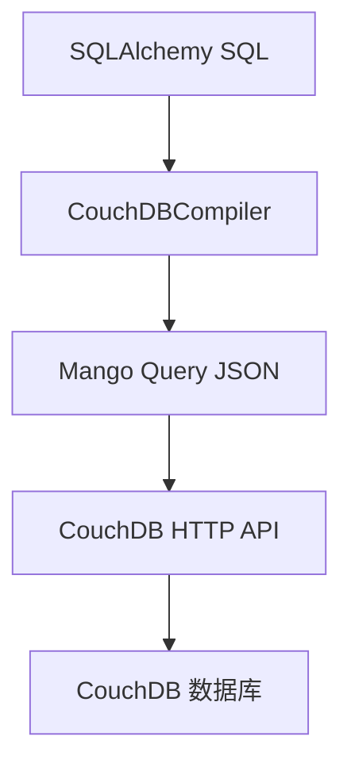

# SQL 转 Mango Query 指南

## 概述

SQLAlchemy CouchDB 方言的核心功能是将标准 SQL 语句自动转换为 CouchDB Mango Query。本文档详细说明转换原理和常见模式。

## 转换原理

### 编译器架构



**编译器组件**:
- `CouchDBCompiler`: 主编译器，继承自 SQLCompiler
- `CouchDBTypeCompiler`: 类型转换器
- `CouchDBDDLCompiler`: DDL 语句编译器

## SELECT 语句转换

### 简单 SELECT

**SQL**:
```sql
SELECT * FROM users WHERE type = 'user'
```

**Mango Query**:
```json
{
  "selector": {
    "type": {"$eq": "user"}
  },
  "fields": ["_id", "_rev", "type", "name", "age", "email"],
  "limit": 25
}
```

**实现**:
```python
# compiler.py:visit_select()
def visit_select(self, select, **kwargs):
    # 构建 selector
    selector = self._compile_where(select.whereclause)
    # 构建 fields
    fields = self._compile_fields(select)
    # 构建 limit/skip
    limit = select.limit and self._compile_limit_offset(select)
    # 组装 Mango Query
    return {
        "selector": selector,
        "fields": fields,
        "limit": limit,
        "skip": skip
    }
```

### 带条件的 SELECT

**SQL**:
```sql
SELECT * FROM users
WHERE type = 'user'
  AND age > 25
  AND name IN ('Alice', 'Bob')
ORDER BY age DESC, name ASC
LIMIT 10
OFFSET 20
```

**Mango Query**:
```json
{
  "selector": {
    "type": {"$eq": "user"},
    "age": {"$gt": 25},
    "name": {"$in": ["Alice", "Bob"]}
  },
  "fields": ["_id", "_rev", "type", "name", "age", "email"],
  "sort": [
    {"age": "desc"},
    {"name": "asc"}
  ],
  "limit": 10,
  "skip": 20
}
```

**转换规则**:

| SQL 操作符 | Mango 操作符 | 示例 |
|-----------|-------------|------|
| `=` | `$eq` | `age = 25` |
| `!=` | `$ne` | `age != 25` |
| `>` | `$gt` | `age > 25` |
| `>=` | `$gte` | `age >= 25` |
| `<` | `$lt` | `age < 30` |
| `<=` | `$lte` | `age <= 30` |
| `IN` | `$in` | `name IN ('A', 'B')` |
| `NOT IN` | `$nin` | `name NOT IN ('A', 'B')` |
| `LIKE` | `$regex` | `name LIKE '%Alice%'` |
| `AND` | (默认) | `age > 25 AND active = true` |
| `OR` | `$or` | `age > 30 OR name = 'Bob'` |

### 复杂 WHERE 条件

**SQL**:
```sql
SELECT * FROM users
WHERE (age > 25 AND active = true)
   OR (name = 'Alice' AND status = 'vip')
```

**Mango Query**:
```json
{
  "selector": {
    "$or": [
      {
        "age": {"$gt": 25},
        "active": {"$eq": true}
      },
      {
        "name": {"$eq": "Alice"},
        "status": {"$eq": "vip"}
      }
    ]
  },
  "fields": ["_id", "_rev", "type", "name", "age", "active", "status"]
}
```

**实现**:
```python
# compiler.py:_compile_where()
def _compile_where(self, whereclause):
    if whereclause is None:
        return {}

    if isinstance(whereclause, expression.And):
        # 处理 AND
        left = self._compile_where(whereclause.left)
        right = self._compile_where(whereclause.right)
        return {**left, **right}  # 合并

    elif isinstance(whereclause, expression.Or):
        # 处理 OR
        left = self._compile_where(whereclause.left)
        right = self._compile_where(whereclause.right)
        return {"$or": [left, right]}

    # 处理比较操作符
    return self._compile_condition(whereclause)
```

## INSERT 语句转换

### 单条插入

**SQL**:
```sql
INSERT INTO users (_id, name, age, email, type)
VALUES ('user:123', 'Alice', 30, 'alice@example.com', 'user')
```

**Mango Query**:
```bash
POST /mydb
Content-Type: application/json

{
  "_id": "user:123",
  "name": "Alice",
  "age": 30,
  "email": "alice@example.com",
  "type": "user"
}
```

**实现**:
```python
# compiler.py:visit_insert()
def visit_insert(self, insert, **kwargs):
    # 提取字段和值
    fields, values = self._extract_fields_and_values(insert)
    # 构建文档
    doc = dict(zip(fields, values))
    # 调用 bulk_docs API
    return {"method": "POST", "docs": [doc]}
```

### 批量插入

**SQL**:
```sql
INSERT INTO users (_id, name, age, type)
VALUES
  ('user:1', 'Alice', 30, 'user'),
  ('user:2', 'Bob', 25, 'user'),
  ('user:3', 'Charlie', 35, 'user')
```

**Mango Query**:
```bash
POST /mydb/_bulk_docs
Content-Type: application/json

{
  "docs": [
    {"_id": "user:1", "name": "Alice", "age": 30, "type": "user"},
    {"_id": "user:2", "name": "Bob", "age": 25, "type": "user"},
    {"_id": "user:3", "name": "Charlie", "age": 35, "type": "user"}
  ]
}
```

**实现**:
```python
# 批量插入会调用 _bulk_docs 端点
{
  "method": "POST",
  "endpoint": "/_bulk_docs",
  "docs": [doc1, doc2, doc3]
}
```

## UPDATE 语句转换

### 简单更新

**SQL**:
```sql
UPDATE users
SET age = 31
WHERE _id = 'user:123' AND type = 'user'
```

**Mango Query**:
```bash
POST /mydb/_bulk_docs
Content-Type: application/json

{
  "docs": [
    {
      "_id": "user:123",
      "_rev": "1-abc123",
      "$set": {"age": 31}
    }
  ]
}
```

**乐观锁机制**:

```python
# compiler.py:visit_update()
def visit_update(self, update, **kwargs):
    # 步骤1: 根据 WHERE 条件查找文档
    selector = self._compile_where(update.whereclause)

    # 步骤2: 获取文档的 _rev
    docs = self.client.find(selector, fields=["_id", "_rev"])

    # 步骤3: 构建更新操作
    updated_docs = []
    for doc in docs:
        doc["$set"] = self._compile_set_clause(update)
        updated_docs.append(doc)

    # 步骤4: 使用 bulk_docs 更新
    return {
        "method": "POST",
        "endpoint": "/_bulk_docs",
        "docs": updated_docs
    }
```

**关键点**:
1. **必须包含 `_rev`**: CouchDB 乐观锁机制
2. **使用 `$set` 操作**: 避免覆盖整个文档
3. **先查询再更新**: 获取最新的 `_rev`

### 多字段更新

**SQL**:
```sql
UPDATE users
SET age = 31, name = 'Alice Updated', is_active = true
WHERE _id = 'user:123' AND type = 'user'
```

**Mango Query**:
```bash
{
  "docs": [
    {
      "_id": "user:123",
      "_rev": "1-abc123",
      "$set": {
        "age": 31,
        "name": "Alice Updated",
        "is_active": true
      }
    }
  ]
}
```

## DELETE 语句转换

### 删除文档

**SQL**:
```sql
DELETE FROM users
WHERE _id = 'user:123' AND type = 'user'
```

**Mango Query**:
```bash
POST /mydb/_bulk_docs
Content-Type: application/json

{
  "docs": [
    {
      "_id": "user:123",
      "_rev": "1-abc123",
      "_deleted": true
    }
  ]
}
```

**实现**:
```python
# compiler.py:visit_delete()
def visit_delete(self, delete, **kwargs):
    # 步骤1: 查找要删除的文档
    selector = self._compile_where(delete.whereclause)
    docs = self.client.find(selector, fields=["_id", "_rev"])

    # 步骤2: 标记为删除
    for doc in docs:
        doc["_deleted"] = True

    # 步骤3: 使用 bulk_docs
    return {
        "method": "POST",
        "endpoint": "/_bulk_docs",
        "docs": docs
    }
```

## ORDER BY 和索引

### 自动索引创建

**SQL**:
```sql
SELECT * FROM users
WHERE type = 'user'
ORDER BY age DESC, name ASC
```

**过程**:
1. **编译 SQL** → Mango Query
2. **检测排序字段** → `["age", "name"]`
3. **检查索引** → 使用 `ensure_index()`
4. **执行查询** → 如果索引不存在，先创建

**实现**:
```python
# compiler.py:_compile_order_by()
def _compile_order_by(self, order_by):
    sort = []
    for item in order_by:
        field = item.element.name
        direction = "desc" if item.desc else "asc"
        sort.append({field: direction})

        # 自动创建索引
        self.client.ensure_index(field)

    return sort
```

**索引设计**:
```python
# 复合索引
{
  "index": {
    "fields": [
      {"age": "desc"},
      {"name": "asc"}
    ],
    "name": "age-name-index"
  }
}
```

## LIMIT 和 OFFSET

### 分页查询

**SQL**:
```sql
SELECT * FROM users
WHERE type = 'user'
ORDER BY _id
LIMIT 10
OFFSET 20
```

**Mango Query**:
```json
{
  "selector": {"type": {"$eq": "user"}},
  "fields": ["_id", "_rev", "type", "name", "age"],
  "sort": [{"_id": "asc"}],
  "limit": 10,
  "skip": 20
}
```

**注意**: CouchDB 的 `skip` 会跳过前面的文档，性能较差。建议使用 `startkey` 和 `limit` 实现高效分页。

## 参数绑定

### BindParameter 处理

SQLAlchemy 2.0 使用 `BindParameter` 进行参数绑定：

**SQL**:
```python
conn.execute(
    text("SELECT * FROM users WHERE age > :age"),
    {"age": 25}
)
```

**绑定值提取**:
```python
# compiler.py:_extract_value()
def _extract_value(self, value):
    if isinstance(value, BindParameter):
        return value.value  # 提取实际值
    return value
```

### 序列化过程

```python
# compiler.py:_serialize_for_json()
def _serialize_for_json(self, value):
    if isinstance(value, datetime):
        return value.isoformat()  # 转换为 ISO 8601
    elif isinstance(value, date):
        return value.isoformat()
    elif isinstance(value, Decimal):
        return str(value)  # 高精度数值
    elif isinstance(value, (dict, list)):
        return value  # JSON 原生支持
    return value
```

## 调试转换过程

### 启用调试日志

```python
import logging
logging.basicConfig(level=logging.DEBUG)

# 设置编译器日志
logging.getLogger('sqlalchemy_couchdb.compiler').setLevel(logging.DEBUG)
```

### 手动编译测试

```python
from sqlalchemy import text
from sqlalchemy_couchdb.compiler import CouchDBCompiler

# 手动编译 SQL
compiler = CouchDBCompiler(None, None)
sql = text("SELECT * FROM users WHERE age > 25")
mango_query = compiler.process(sql)

print("Mango Query:", mango_query)
```

## 性能优化

### 1. 索引优化

```python
# ✅ 好：使用索引字段排序
SELECT * FROM users ORDER BY age  # age 字段有索引

# ❌ 差：无索引字段排序
SELECT * FROM users ORDER BY name  # name 字段无索引
```

### 2. 限制返回字段

```python
# ✅ 好：只查询需要的字段
SELECT _id, name FROM users

# ❌ 差：查询所有字段
SELECT * FROM users
```

### 3. 合理使用 WHERE

```python
# ✅ 好：精确筛选
SELECT * FROM users WHERE type = 'user' AND age > 25

# ❌ 差：宽泛筛选
SELECT * FROM users
```

## 限制说明

### 不支持的 SQL 特性

| SQL 特性 | 原因 | 替代方案 |
|---------|------|----------|
| `JOIN` | 文档数据库无关联查询 | 使用嵌入式文档或多次查询 |
| `GROUP BY` | 无原生聚合 | 使用 MapReduce 视图 |
| `UNION` | 不支持 | 多次查询合并结果 |
| `子查询` | 嵌套查询复杂 | 预查询或应用层处理 |
| `HAVING` | 需要聚合 | 使用视图或应用层过滤 |

### 转换限制

1. **最大查询深度**: Mango Query 嵌套不能超过 5 层
2. **索引依赖**: 复杂排序需要预先创建索引
3. **正则表达式**: LIKE 查询使用 `$regex`，性能较低

## 调试工具

### 查看生成的 Mango Query

```python
from sqlalchemy_couchdb.compiler import CouchDBCompiler

# 启用详细日志
import logging
logging.basicConfig(level=logging.DEBUG)

# 执行查询时会输出编译过程
result = conn.execute(text("SELECT * FROM users WHERE age > 25"))
```

### 手动测试 Mango Query

```python
import httpx

# 直接使用 Mango Query
with httpx.Client() as client:
    response = client.post(
        'http://localhost:5984/mydb/_find',
        json={
            "selector": {"type": {"$eq": "user"}},
            "limit": 10
        }
    )
    print(response.json())
```

## 下一步

- [同步操作](sync-operations.md)
- [异步操作](async-operations.md)
- [类型映射](type-mapping.md)
